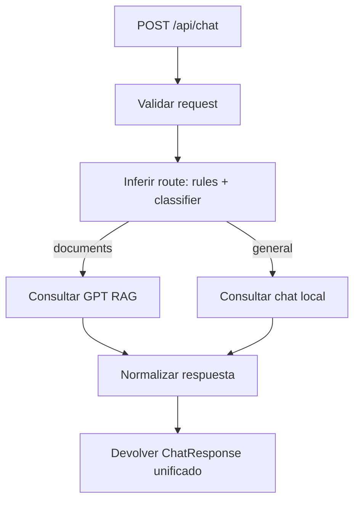

# Backend Chat Routing (Orquestador Unificado)

## Objetivo

Unificar el chat en un solo endpoint (`POST /api/chat`) para que **backend decida automáticamente** si responde con:

- Chat general (motor local/Ollama)
- GPT con RAG documental (`/api/gpt/chat`)

El frontend ya está en modo panel único, por lo tanto no debe decidir proveedor.

---

## Contrato que debe mantenerse (compatibilidad frontend)

El frontend actual consume este formato desde `/api/chat`:

```ts
interface ChatRequest {
  sessionId?: string;
  message: string;
  userId?: string;
}

interface ChatResponse {
  sessionId: string;
  response: {
    message: string;
    sources: string[];
    tokensUsed?: {
      input: number;
      output: number;
    };

    // Recomendado (nuevo, opcional):
    engine?: "gpt-rag" | "local-chat";
    route?: "documents" | "general";
  };
}
```

Notas:
- `message` es lo que renderiza el chat.
- `sources` debe existir siempre (puede ser `[]`).
- Campos nuevos (`engine`, `route`) no rompen el frontend actual.

---

## Estrategia de decisión (routing)

## 1) Clasificación rápida por reglas

Enviar a `documents` si detecta términos como:

- `pep`, `proyecto educativo`, `perfil de egresado`, `competencias`
- `requisitos de grado`, `mision`, `vision`
- `plan de estudios`, `pensum`, `documento`, `acuerdo`, `resolucion`
- nombres de programas/facultades cuando pide datos formales

Si no matchea, pasar a clasificador LLM liviano.

## 2) Clasificador LLM (fallback)

Prompt recomendado:

```txt
Eres un clasificador de intención para un chatbot universitario.
Devuelve SOLO JSON válido con una propiedad "route".
Valores permitidos: "documents" o "general".

Usa "documents" cuando la respuesta dependa de documentos institucionales verificables
(PEP, perfil de egresado, competencias, requisitos de grado, misión/visión,
plan de estudios, reglamentos, acuerdos, resoluciones).

Usa "general" para conversación abierta, saludos, orientación no documental,
o preguntas que no requieren citar documentos.

Formato de salida obligatorio:
{"route":"documents"}
o
{"route":"general"}
```

## 3) Política de fallback

- Si `route = documents` y GPT/RAG falla:
  - fallback a chat general
  - agregar aviso suave en respuesta (ej. "No pude consultar documentos en este momento...")
  - registrar evento de degradación
- Si clasificador falla/parsing inválido:
  - default: `general`

---

## Flujo sugerido



---

## Pseudocódigo de referencia

```ts
type Route = "documents" | "general";

function normalizeSources(input: unknown): string[] {
  if (!Array.isArray(input)) return [];
  return input
    .map((s) => (typeof s === "string" ? s : ""))
    .filter(Boolean);
}

async function routeMessage(message: string): Promise<Route> {
  const normalized = message.toLowerCase();

  const keywords = [
    "pep",
    "proyecto educativo",
    "perfil de egresado",
    "competencias",
    "requisitos de grado",
    "mision",
    "vision",
    "plan de estudios",
    "pensum",
    "acuerdo",
    "resolucion",
  ];

  if (keywords.some((k) => normalized.includes(k))) {
    return "documents";
  }

  try {
    const cls = await classifyWithLLM(message); // { route: "documents" | "general" }
    return cls?.route === "documents" ? "documents" : "general";
  } catch {
    return "general";
  }
}

export async function postChatController(req, res) {
  const { message, sessionId } = req.body;

  if (!message || typeof message !== "string") {
    return res.status(400).json({ error: true, message: "message es requerido" });
  }

  const route = await routeMessage(message);
  const currentSessionId = sessionId ?? crypto.randomUUID();

  try {
    if (route === "documents") {
      const gpt = await gptChat({ message }); // endpoint interno o servicio

      return res.json({
        sessionId: currentSessionId,
        response: {
          message: gpt.response,
          sources: (gpt.documents ?? []).map((d) => d.filename),
          engine: "gpt-rag",
          route,
        },
      });
    }

    const local = await localChat({ sessionId: currentSessionId, message });

    return res.json({
      sessionId: currentSessionId,
      response: {
        message: local.response?.message ?? "",
        sources: normalizeSources(local.response?.sources),
        tokensUsed: local.response?.tokensUsed,
        engine: "local-chat",
        route,
      },
    });
  } catch (err) {
    if (route === "documents") {
      // fallback degradado
      const local = await localChat({ sessionId: currentSessionId, message });
      return res.json({
        sessionId: currentSessionId,
        response: {
          message:
            "No pude consultar documentos institucionales en este momento. " +
            (local.response?.message ?? "Intenta nuevamente en unos minutos."),
          sources: normalizeSources(local.response?.sources),
          engine: "local-chat",
          route: "general",
        },
      });
    }

    return res.status(500).json({ error: true, message: "Error interno" });
  }
}
```

---

## Requisitos no funcionales recomendados

- Timeout clasificación: `2s`
- Timeout GPT RAG: `30s`
- Timeout chat local: `20s`
- Métricas por ruta:
  - `chat_route_documents_total`
  - `chat_route_general_total`
  - `chat_route_fallback_total`
  - latencia por motor
- Logs mínimos por request:
  - `requestId`, `sessionId`, `route`, `engine`, `latencyMs`, `success/fail`

---

## Casos de prueba mínimos

1. Pregunta documental:
- Input: "¿Cuál es el perfil del egresado de Ingeniería de Sistemas?"
- Esperado: `route=documents`, `engine=gpt-rag`, `sources` con archivos

2. Pregunta general:
- Input: "Hola, ¿me puedes ayudar a elegir carrera?"
- Esperado: `route=general`, `engine=local-chat`

3. Falla GPT:
- Input: documental + GPT caído
- Esperado: fallback a `general`, respuesta 200, mensaje de degradación

4. Entrada inválida:
- Input: `{}`
- Esperado: 400

---

## Resumen operativo

Frontend: siempre `POST /api/chat`.

Backend:
1. clasifica intención
2. llama motor correcto
3. normaliza salida al contrato único
4. aplica fallback si GPT falla

Con esto se mantiene una sola vista y una sola integración en frontend, dejando la inteligencia de enrutamiento 100% en backend.
