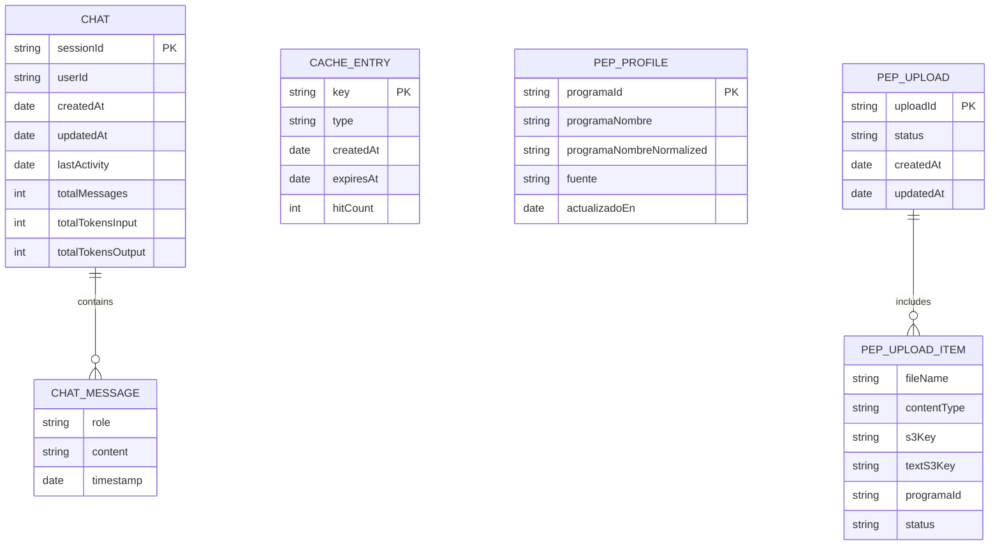
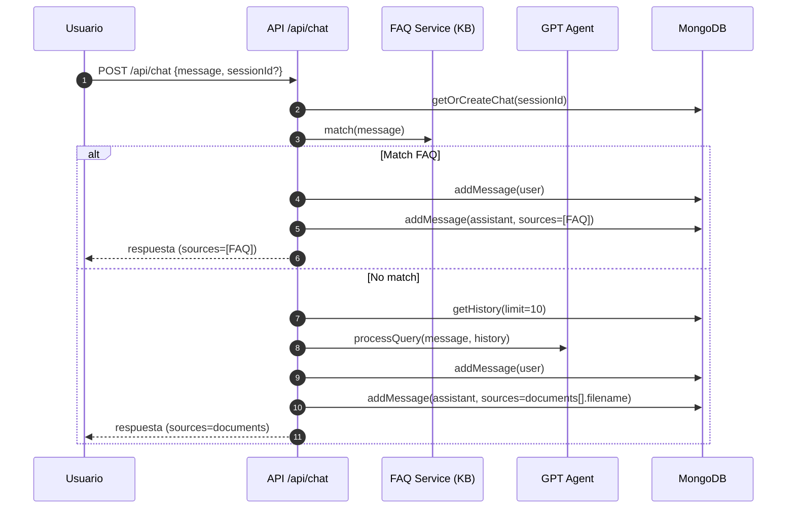
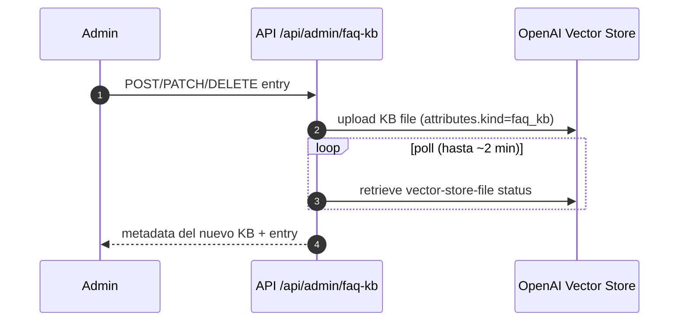
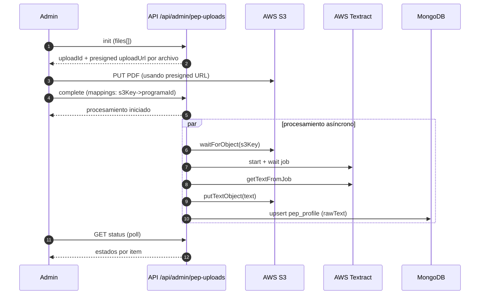
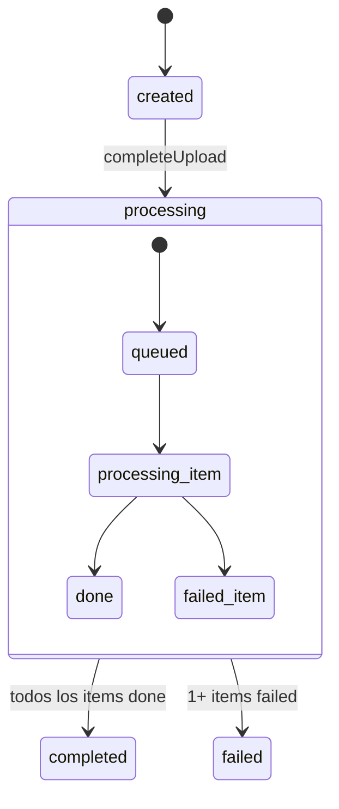

# UConnect (v1) — Documentación general

## 1. Resumen
UConnect (v1) es un backend para un chatbot universitario orientado a estudiantes y aspirantes de la **Universidad de Córdoba**. El sistema busca responder preguntas frecuentes, orientar procesos de admisión y apoyar consultas académicas (por ejemplo, pensum/materias) combinando: una base de preguntas frecuentes (FAQ), recuperación de información desde documentos institucionales (RAG) y datos académicos estructurados.

El proyecto está construido con **Node.js + TypeScript**, expone una **API REST** (Express) para consumo desde un frontend, persiste sesiones e interacciones en **MongoDB**, e integra **OpenAI** (Vector Store) y **Ollama** (opcional) como motores de IA.

---

## 2. Introducción
En contextos universitarios, gran parte de la información relevante para estudiantes y aspirantes se encuentra distribuida entre múltiples documentos, canales de comunicación y dependencias administrativas. Esto genera fricción: encontrar respuestas confiables toma tiempo, la información se consulta repetidamente y los equipos de atención suelen operar con alta carga y horarios limitados.

UConnect se plantea como una solución de asistencia conversacional que:
- Centraliza el acceso a información institucional (cuando está disponible en documentos).
- Reduce respuestas improvisadas mediante fuentes verificables (RAG) y datos estructurados.
- Ofrece orientación general responsable cuando no exista soporte documental suficiente.

---

## 3. Planteamiento del problema
### 3.1 Situación actual
- Los estudiantes/aspirantes realizan consultas recurrentes (admisión, requisitos, orientación, trámites, y dudas académicas).
- La información suele estar fragmentada (documentos PDF/guías, enlaces, comunicados) y no siempre es fácil de localizar.
- Los canales humanos de atención pueden saturarse, afectando tiempos de respuesta y continuidad del acompañamiento.

### 3.2 Problema
Se requiere un mecanismo que permita **atender consultas de manera consistente, rápida y trazable**, minimizando el riesgo de desinformación y facilitando la actualización del conocimiento institucional.

### 3.3 Necesidad
- Proveer respuestas con **base verificable** (documentos institucionales) cuando existan.
- Responder con **FAQ** cuando la pregunta corresponde a conocimiento recurrente y curado.
- Para consultas estructuradas (por ejemplo, **pensum/materias**), utilizar datos académicos tabulados y limitar la IA a tareas de redacción/formateo.

---

## 4. Justificación
UConnect es relevante porque:
- Mejora la **experiencia** del estudiante/aspirante al reducir el tiempo de búsqueda.
- Disminuye la **carga operativa** de atención repetitiva.
- Permite una base de conocimiento **mantenible** (FAQ y documentos) con control administrativo.
- Reduce el riesgo de “alucinaciones” del modelo al priorizar datos estructurados y recuperación desde documentos.

---

## 5. Objetivos
### 5.1 Objetivo general
Diseñar e implementar un sistema conversacional que brinde **orientación académica y de admisiones** de forma clara y responsable, apoyado en **documentos institucionales** y **datos académicos estructurados**, con persistencia y administración de conocimiento.

### 5.2 Objetivos específicos
- Implementar una API REST para gestionar sesiones y mensajes del chat.
- Integrar un mecanismo de respuesta por **FAQ** para preguntas frecuentes.
- Integrar un mecanismo de respuesta por **RAG** (búsqueda en Vector Store) para preguntas que requieran evidencia documental.
- Resolver consultas de **pensum/materias** usando datos locales estructurados y restringiendo el modelo a generación de texto basado en esos datos.
- Persistir historial y metadatos de conversación en MongoDB.
- Proveer endpoints administrativos para gestión de base de conocimiento (FAQ KB y documentos).
- Proteger endpoints administrativos mediante autenticación (por defecto con Firebase Admin).

---

## 6. Alcance
### 6.1 Alcance funcional (incluye)
- Chat con sesiones e historial.
- Enrutamiento de respuesta:
  - FAQ (conjunto curado/cached).
  - RAG con OpenAI Vector Store para documentos.
  - Pensum/materias usando datos académicos locales.
- Administración de conocimiento:
  - CRUD de FAQ KB (crear/editar/desactivar entradas).
  - Subida/listado/eliminación de documentos para el Vector Store.
- Gestión de perfiles PEP (Perfil de Programa) desde texto plano y soporte para carga masiva (S3/Textract) a través de endpoints admin.

### 6.2 Fuera de alcance (no incluye)
- Sustituir canales oficiales de la Universidad (la herramienta es de apoyo).
- Procesos transaccionales institucionales (matrícula, pagos, inscripción automática, etc.).
- Garantía de veracidad si los documentos base no están actualizados o no existen.
- Interpretación legal o decisiones administrativas vinculantes.

---

## 7. Usuarios y actores
- **Aspirantes/estudiantes**: realizan preguntas y reciben orientación.
- **Equipo de admisiones/soporte** (indirecto): reduce carga repetitiva y puede alimentar la base de conocimiento.
- **Administrador de contenido**: gestiona FAQ KB, documentos y perfiles PEP.
- **Equipo técnico**: opera el despliegue, monitoreo y mantenimiento.

---

## 8. Requisitos
### 8.1 Requisitos funcionales (RF)
- RF-01: Crear sesiones de chat y retornar identificadores (sessionId/userId).
- RF-02: Recibir mensajes y retornar respuestas del asistente.
- RF-03: Consultar historial de conversación por sesión.
- RF-04: Consultar preguntas frecuentes disponibles y buscar FAQs por texto.
- RF-05: Gestionar (admin) entradas de FAQ KB.
- RF-06: Gestionar (admin) documentos del vector store (subir/listar/eliminar).
- RF-07: Gestionar (admin) perfiles PEP (crear/actualizar/listar/eliminar) y cargas masivas.

#### 8.1.1 Especificación funcional (detalle por módulo)
> Nota: los requisitos se formulan en términos de comportamiento y se vinculan a las interfaces existentes (API REST y MCP).

**Chat y sesiones (público)**
- RF-CH-01: El sistema debe permitir crear una sesión de chat y retornar `sessionId` y `userId` (`POST /api/chat/session`).
- RF-CH-02: Al crear sesión, el sistema debe retornar `suggestedQuestions` (desde FAQs destacadas si están disponibles; de lo contrario, usar preguntas guiadas por defecto).
- RF-CH-03: El sistema debe permitir enviar un mensaje y obtener una respuesta (`POST /api/chat`).
- RF-CH-04: El sistema debe validar que `message` sea string no vacío; si no, responder `400` con código `INVALID_REQUEST`.
- RF-CH-05: El sistema debe rechazar mensajes que excedan 1000 caracteres; si excede, responder `400` con código `MESSAGE_TOO_LONG`.
- RF-CH-06: El sistema debe aceptar `sessionId` y/o `userId` opcionales; si no existen, debe generar identificadores.
- RF-CH-07: El sistema debe persistir el mensaje del usuario y la respuesta del asistente en el historial de la sesión (MongoDB).
- RF-CH-08: El sistema debe priorizar respuestas desde **FAQ** cuando exista coincidencia (ruta de respuesta por FAQ).
- RF-CH-09: Si no hay coincidencia FAQ, el sistema debe obtener respuesta vía **RAG/Documentos** (ruta de respuesta por GPT Agent).
- RF-CH-10: El sistema debe permitir consultar el historial de una sesión con un límite configurable (`GET /api/chat/:sessionId/history?limit=N`).
- RF-CH-11: Si una sesión no existe o no tiene mensajes, el sistema debe responder `404` con código `SESSION_NOT_FOUND`.
- RF-CH-12: El sistema debe exponer una acción para finalizar sesión (`DELETE /api/chat/:sessionId`).
- RF-CH-13: El sistema debe permitir registrar feedback del usuario sobre una sesi??n de chat (`POST /api/chat/:sessionId/feedback`).
- RF-CH-14: El feedback debe aceptar score, helpful/resolved, categor??a y comentario opcional para an??lisis posterior.

**FAQ (público)**
- RF-FAQ-01: El sistema debe listar preguntas por categorías/tier (featured/faq/archive) (`GET /api/faq/questions`).
- RF-FAQ-02: El sistema debe permitir incluir/excluir el archivo de preguntas archivadas vía `includeArchive`.
- RF-FAQ-03: El sistema debe permitir buscar FAQs por texto (`GET /api/faq/search?q=...`).
- RF-FAQ-04: El sistema debe validar que `q` exista y sea string; si no, responder `400` con `INVALID_REQUEST`.
- RF-FAQ-05: El sistema debe rechazar consultas `q` mayores a 200 caracteres; si excede, responder `400` con `QUERY_TOO_LONG`.
- RF-FAQ-06: El sistema debe retornar las mejores coincidencias con un límite (`limit`) y un puntaje (score).
- RF-FAQ-07: El sistema debe permitir obtener la respuesta FAQ por identificador (`GET /api/faq/:questionId`).

**GPT Agent / RAG (público)**
- RF-GPT-01: El sistema debe permitir procesar una consulta con el agente GPT y retornar respuesta + documentos usados (`POST /api/gpt/chat`).
- RF-GPT-02: El sistema debe validar `message` en `POST /api/gpt/chat` con reglas equivalentes a chat (requerido, max 1000).
- RF-GPT-03: El sistema debe exponer un endpoint de disponibilidad del proveedor GPT (`GET /api/gpt/health`).

**Observabilidad (público)**
- RF-OBS-01: El sistema debe exponer un health check del backend y dependencias principales (`GET /api/health`).
- RF-OBS-02: El sistema debe exponer estadísticas agregadas del uso de chat (`GET /api/stats`).
- RF-OBS-03: El sistema debe registrar m??tricas de uso por sesi??n y por d??a, incluyendo sesiones, usuarios ??nicos aproximados, preguntas, duraci??n y distribuci??n por ruta (FAQ/Documentos).
- RF-OBS-04: El sistema debe registrar m??tricas de feedback con promedio de score, helpful rate, resoluci??n, categor??as y distribuci??n diaria.

**Administración (protegido bajo `/api/admin/*`)**
- RF-ADM-AUTH-01: El sistema debe proteger `/api/admin/*` con autenticación; por defecto requiere `Authorization: Bearer <ID_TOKEN>` (Firebase Admin).
- RF-ADM-AUTH-02: Si falta el token, el sistema debe responder `401` con `UNAUTHORIZED`.
- RF-ADM-AUTH-03: Si el usuario autenticado no es admin, el sistema debe responder `403` con `FORBIDDEN`.

**Admin — PEP (perfil de programa)**
- RF-ADM-PEP-01: El sistema debe permitir crear/actualizar un PEP a partir de texto plano (`POST /api/admin/pep`).
- RF-ADM-PEP-02: El sistema debe permitir consultar un PEP por `programaId` (`GET /api/admin/pep/:programaId`).
- RF-ADM-PEP-03: El sistema debe permitir listar todos los PEP (`GET /api/admin/peps`).
- RF-ADM-PEP-04: El sistema debe permitir eliminar un PEP por `programaId` (`DELETE /api/admin/pep/:programaId`).

**Admin — Cargas masivas PEP (S3/Textract)**
- RF-ADM-PEPUP-01: El sistema debe inicializar cargas masivas y retornar URLs pre-firmadas (`POST /api/admin/pep-uploads/init`).
- RF-ADM-PEPUP-02: El sistema debe completar una carga masiva asignando mapeos de programa y disparar el procesamiento (`POST /api/admin/pep-uploads/complete`).
- RF-ADM-PEPUP-03: El sistema debe permitir consultar el estado de una carga por `uploadId` (`GET /api/admin/pep-uploads/:uploadId`).

**Admin — FAQ KB (CRUD)**
- RF-ADM-FAQKB-01: El sistema debe permitir consultar el KB activo y su metadata (`GET /api/admin/faq-kb`).
- RF-ADM-FAQKB-02: El sistema debe permitir crear una entrada FAQ (subiendo una nueva versión del KB) (`POST /api/admin/faq-kb/entries`).
- RF-ADM-FAQKB-03: El sistema debe permitir actualizar una entrada FAQ por id (`PATCH /api/admin/faq-kb/entries/:id`).
- RF-ADM-FAQKB-04: El sistema debe permitir eliminar (soft delete) una entrada FAQ por id (`DELETE /api/admin/faq-kb/entries/:id`).

**Admin — Documentos del Vector Store**
- RF-ADM-VS-01: El sistema debe listar archivos del vector store (incluye estado/atributos) (`GET /api/admin/vector-store/vector-files`).
- RF-ADM-VS-02: El sistema debe listar archivos disponibles en el proveedor (`GET /api/admin/vector-store/files`).
- RF-ADM-VS-03: El sistema debe permitir subir un archivo y esperar su procesamiento (`POST /api/admin/vector-store/files`, multipart, campo `file`).
- RF-ADM-VS-04: El sistema debe permitir asociar un atributo opcional `kind` al subir el archivo.
- RF-ADM-VS-05: El sistema debe permitir eliminar un archivo por `fileId` (`DELETE /api/admin/vector-store/files/:fileId`).

**Servidor MCP (opcional)**
- RF-MCP-01: El sistema debe exponer herramientas para consultar datos académicos desde JSON local (facultades, programas y pensum) para clientes compatibles con MCP.

#### 8.1.2 Reglas de negocio y validaciones (resumen)
- RB-01: Mensajes de chat: `message` requerido y longitud máxima 1000.
- RB-02: Búsqueda FAQ: `q` requerido y longitud máxima 200.
- RB-03: Subida de archivos (admin): límite de tamaño de archivo 10 MB por request.
- RB-04: Enrutamiento del chat: prioridad a FAQ; si no hay match, usar RAG.
- RB-05: Persistencia: todo mensaje (usuario/asistente) debe registrarse con su `sessionId`.
- RB-06: Protección anti-abuso: `POST /api/chat` y `POST /api/gpt/chat` deben estar limitados a 30 solicitudes por minuto por origen (rate limit).
- RB-07: Límite de payload: JSON público hasta 10kb; JSON admin hasta 500kb; JSON admin de FAQ KB hasta 200kb.
- RB-08: Retención de historial: los chats se eliminan automáticamente por TTL 24h después de `metadata.lastActivity` (retención corta por diseño).
- RB-09: Selección de FAQ KB: el runtime debe usar el archivo más reciente del vector store con `attributes.kind='faq_kb'` y `status='completed'` (o permitir override con `FAQ_KB_VECTOR_STORE_FILE_ID`).
- RB-10: Cargas masivas PEP: solo los ítems mapeados a `programaId` pasan a `queued` y se procesan; el procesamiento es asíncrono y su estado se consulta por `uploadId`.

### 8.2 Requisitos no funcionales (RNF)
- RNF-01: Seguridad básica HTTP (headers) y control de CORS.
- RNF-02: Rate limiting para mitigar abuso en endpoints de chat.
- RNF-03: Protección de endpoints administrativos (por defecto Firebase Admin).
- RNF-04: Observabilidad mínima: logs y endpoint de salud (/api/health).
- RNF-05: Configuración por variables de entorno, sin secretos en el repositorio.
- RNF-06: Mantenibilidad: modularidad por servicios, repositorios y utilidades.
- RNF-07: Retención/privacidad: minimizar persistencia de chats (TTL 24h) y evitar almacenar información sensible innecesaria.
- RNF-08: Resiliencia: si el FAQ KB falla en refrescar y existe snapshot previo, debe mantenerse servicio con datos cacheados (best-effort).
- RNF-09: Operabilidad: el servicio debe ser ejecutable en contenedor con healthcheck HTTP y configuración sin intervención manual.

### 8.3 Casos de uso (CU)
#### 8.3.1 Resumen de casos de uso
| ID | Actor principal | Objetivo | Interfaces |
|---|---|---|---|
| CU-01 | Estudiante/Aspirante | Iniciar sesión de chat | `POST /api/chat/session` |
| CU-02 | Estudiante/Aspirante | Enviar mensaje y obtener respuesta (FAQ) | `POST /api/chat` |
| CU-03 | Estudiante/Aspirante | Enviar mensaje y obtener respuesta (RAG) | `POST /api/chat` |
| CU-04 | Estudiante/Aspirante | Consultar historial de conversación | `GET /api/chat/:sessionId/history` |
| CU-05 | Estudiante/Aspirante | Consultar preguntas frecuentes | `GET /api/faq/questions` |
| CU-06 | Estudiante/Aspirante | Buscar preguntas frecuentes por texto | `GET /api/faq/search` |
| CU-07 | Equipo técnico | Ver salud del servicio | `GET /api/health` |
| CU-08 | Administrador | Gestionar FAQ KB (crear/editar/eliminar) | `/api/admin/faq-kb/*` |
| CU-09 | Administrador | Gestionar documentos del vector store | `/api/admin/vector-store/*` |
| CU-10 | Administrador | Gestionar PEP | `/api/admin/pep*` |
| CU-11 | Administrador | Procesar cargas masivas PEP | `/api/admin/pep-uploads/*` |
| CU-12 | Cliente MCP | Consultar datos académicos (herramientas MCP) | Servidor MCP (stdio) |
| CU-13 | Equipo técnico | Consultar estadísticas agregadas | `GET /api/stats` |
| CU-14 | Equipo técnico/Frontend | Verificar disponibilidad del proveedor GPT | `GET /api/gpt/health` |
| CU-15 | Estudiante/Aspirante | Enviar mensaje directo al GPT Agent (sin FAQ) | `POST /api/gpt/chat` |
| CU-16 | Administrador | Consultar FAQ KB admin (opcional force refresh) | `GET /api/admin/faq-kb?forceRefresh=1` |
| CU-17 | Administrador | Listar “vector-files” (status/attributes/errores) | `GET /api/admin/vector-store/vector-files` |
| CU-18 | Estudiante/Aspirante | Finalizar sesión (cierre lógico) | `DELETE /api/chat/:sessionId` |

#### CU-01 — Iniciar sesión de chat
- **Actor**: Estudiante/Aspirante (a través del frontend).
- **Precondiciones**: API disponible; base de datos accesible para crear/recuperar sesión.
- **Flujo principal**:
  1. El frontend solicita `POST /api/chat/session`.
  2. El backend genera `sessionId` y `userId`.
  3. El backend retorna `suggestedQuestions` para iniciar la conversación.
- **Postcondición**: existe un contenedor lógico de conversación asociado a la sesión.

#### CU-02 — Enviar mensaje (respuesta por FAQ)
- **Actor**: Estudiante/Aspirante.
- **Precondiciones**: sesión existente o el backend genera una nueva; `message` válido.
- **Flujo principal**:
  1. El frontend envía `POST /api/chat` con `message` y opcionalmente `sessionId`.
  2. El backend evalúa coincidencia en FAQ.
  3. Si hay match, retorna la respuesta con `sources: ["FAQ"]`.
- **Excepciones**:
  - Si `message` no es válido → `400 (INVALID_REQUEST / MESSAGE_TOO_LONG)`.

#### CU-03 — Enviar mensaje (respuesta por documentos / RAG)
- **Actor**: Estudiante/Aspirante.
- **Precondiciones**: configuración de OpenAI y vector store disponible.
- **Flujo principal**:
  1. El frontend envía `POST /api/chat`.
  2. El backend no encuentra match FAQ.
  3. Si la consulta corresponde a pensum/materias, el backend puede construir el contexto desde datos JSON locales y usar GPT solo para formatear.
  4. En el resto de casos, el backend realiza búsqueda semántica en el vector store y construye contexto.
  5. El backend retorna respuesta y lista de documentos usados como fuentes.
- **Excepciones**:
  - Si no se encuentran documentos relevantes, el agente responde con orientación general (sin inventar datos institucionales).
  - Si el proveedor GPT no está disponible, el backend responde con error interno.

#### CU-04 — Consultar historial de conversación
- **Actor**: Estudiante/Aspirante.
- **Precondiciones**: `sessionId` existente con mensajes.
- **Flujo principal**:
  1. El frontend solicita `GET /api/chat/:sessionId/history?limit=N`.
  2. El backend retorna mensajes más recientes hasta el límite.
- **Excepciones**:
  - Si la sesión no existe o no tiene mensajes → `404 (SESSION_NOT_FOUND)`.

#### CU-05 — Consultar preguntas frecuentes (listado)
- **Actor**: Estudiante/Aspirante.
- **Precondiciones**: banco de preguntas accesible.
- **Flujo principal**:
  1. El frontend solicita `GET /api/faq/questions`.
  2. Opcionalmente envía `includeArchive=true|false`.
  3. El backend retorna colecciones `featured`, `faq` y (si aplica) `archive`, junto con `total`.
- **Excepciones**:
  - Si el banco de preguntas no está disponible → `503 (FAQ_KB_UNAVAILABLE)`.

#### CU-06 — Buscar preguntas frecuentes por texto
- **Actor**: Estudiante/Aspirante.
- **Precondiciones**: banco de preguntas accesible.
- **Flujo principal**:
  1. El frontend solicita `GET /api/faq/search?q=...&limit=N`.
  2. El backend valida `q` (requerido, máximo 200 caracteres).
  3. El backend retorna `results` con coincidencias y un score.
- **Excepciones**:
  - `q` ausente/no válido → `400 (INVALID_REQUEST)`.
  - `q` demasiado largo → `400 (QUERY_TOO_LONG)`.
  - KB no disponible → `503 (FAQ_KB_UNAVAILABLE)`.

#### CU-07 — Ver salud del servicio (health check)
- **Actor**: Equipo técnico (operación/monitoreo) o frontend (diagnóstico básico).
- **Precondiciones**: servicio en ejecución.
- **Flujo principal**:
  1. Consumir `GET /api/health`.
  2. El backend retorna estado (`ok`/`degraded`) y un resumen de dependencias (DB y disponibilidad de GPT).
- **Resultado**: permite detectar caídas o degradación antes de afectar a usuarios.

#### CU-08 — Administrar FAQ KB (crear/editar/eliminar)
- **Actor**: Administrador.
- **Precondiciones**: autenticación admin habilitada y válida.
- **Flujo principal**:
  1. El administrador consulta el KB actual (`GET /api/admin/faq-kb`).
  2. Crea/actualiza/elimina entradas (`POST/PATCH/DELETE /api/admin/faq-kb/entries...`).
  3. El sistema publica una nueva versión del KB y la usa para futuros matches.
- **Excepciones**:
  - Falta token → `401`; sin permisos → `403`; KB no disponible → `503`.

#### CU-09 — Administrar documentos del vector store
- **Actor**: Administrador.
- **Precondiciones**: autenticación admin válida; OpenAI configurado.
- **Flujo principal**:
  1. Listar documentos existentes (`GET /api/admin/vector-store/files`).
  2. Subir documento (`POST /api/admin/vector-store/files`, multipart `file`).
  3. El sistema espera a que el documento quede procesado y disponible para búsqueda.
  4. Eliminar documento cuando sea necesario (`DELETE /api/admin/vector-store/files/:fileId`).

#### CU-10 — Administrar PEP (crear/actualizar/eliminar)
- **Actor**: Administrador.
- **Precondiciones**: autenticación admin válida; MongoDB disponible.
- **Flujo principal**:
  1. Enviar texto del PEP con identificadores de programa (`POST /api/admin/pep`).
  2. El sistema parsea el texto a estructura y lo persiste.
  3. Consultar/listar/eliminar según necesidad (`GET /api/admin/pep/:programaId`, `GET /api/admin/peps`, `DELETE /api/admin/pep/:programaId`).

#### CU-11 — Procesar cargas masivas PEP (init/complete/status)
- **Actor**: Administrador.
- **Precondiciones**: autenticación admin válida; S3/Textract configurados; MongoDB disponible.
- **Flujo principal**:
  1. Inicializar carga masiva (`POST /api/admin/pep-uploads/init`) enviando metadatos de archivos (`fileName`, `contentType`).
  2. El sistema retorna un `uploadId` y URLs pre-firmadas para subir archivos al storage.
  3. El administrador (o frontend admin) sube los archivos directamente al storage usando las URLs.
  4. Completar la carga (`POST /api/admin/pep-uploads/complete`) enviando los mapeos (archivo → programa).
  5. Consultar el estado (`GET /api/admin/pep-uploads/:uploadId`) hasta finalizar el procesamiento.
- **Excepciones**:
  - Errores de validación (payload incompleto) → `400 (INVALID_REQUEST)`.
  - Fallas de procesamiento → `500 (INTERNAL_ERROR)`.

#### CU-12 — Consultar datos académicos vía MCP (opcional)
- **Actor**: Cliente MCP (por ejemplo, un agente/cliente de IA que soporte MCP).
- **Precondiciones**: servidor MCP ejecutándose.
- **Flujo principal**:
  1. El cliente lista herramientas disponibles.
  2. El cliente invoca herramientas (p.ej. `listar_facultades`, `buscar_programas`, `obtener_pensum_programa`).
  3. El servidor retorna resultados desde JSON local.

#### CU-13 — Consultar estadísticas agregadas
- **Actor**: Equipo técnico.
- **Precondiciones**: MongoDB disponible.
- **Flujo principal**:
  1. Consumir `GET /api/stats`.
  2. El backend calcula agregados (chats, mensajes, tokens y métricas de caché).
- **Excepciones**:
  - Fallo interno → `500 (INTERNAL_ERROR)`.

#### CU-14 — Verificar disponibilidad del proveedor GPT
- **Actor**: Equipo técnico / frontend.
- **Precondiciones**: API disponible.
- **Flujo principal**:
  1. Consumir `GET /api/gpt/health`.
  2. El backend retorna `available|unavailable` según configuración y acceso al proveedor.
- **Excepciones**:
  - Error de consulta al proveedor → `503` con `status: error`.

#### CU-15 — Enviar mensaje directo al GPT Agent (sin FAQ)
- **Actor**: Estudiante/Aspirante.
- **Precondiciones**: OpenAI configurado; MongoDB disponible.
- **Flujo principal**:
  1. Consumir `POST /api/gpt/chat` con `message` y opcionalmente `sessionId/userId`.
  2. El backend recupera historial (hasta 10 mensajes) y ejecuta el agente.
  3. El backend retorna `response` y `documents` usados.
- **Excepciones**:
  - Validación de request → `400 (INVALID_REQUEST / MESSAGE_TOO_LONG)`.
  - Error interno → `500 (INTERNAL_ERROR)`.

#### CU-16 — Consultar FAQ KB admin (force refresh opcional)
- **Actor**: Administrador.
- **Precondiciones**: autenticación admin válida; OpenAI/vector store configurados.
- **Flujo principal**:
  1. Consumir `GET /api/admin/faq-kb`.
  2. (Opcional) Enviar `forceRefresh=1` para forzar que el runtime recargue el snapshot.
  3. El backend retorna metadata del archivo (`vectorStoreFileId`, `createdAt`) y `entries`.
- **Excepciones**:
  - Falta token → `401`; sin permisos → `403`; KB no disponible → `503 (FAQ_KB_UNAVAILABLE)`.

#### CU-17 — Listar vector store “vector-files”
- **Actor**: Administrador.
- **Precondiciones**: autenticación admin válida; OpenAI/vector store configurados.
- **Flujo principal**:
  1. Consumir `GET /api/admin/vector-store/vector-files`.
  2. El backend retorna objetos con `status`, `usageBytes`, `attributes` y `lastError`.
- **Excepciones**:
  - Error interno → `500 (INTERNAL_ERROR)`.

#### CU-18 — Finalizar sesión (cierre lógico)
- **Actor**: Estudiante/Aspirante.
- **Precondiciones**: API disponible.
- **Flujo principal**:
  1. Consumir `DELETE /api/chat/:sessionId`.
  2. El backend retorna confirmación.
- **Notas**:
  - Es un cierre lógico; el historial se elimina por TTL (24h) o por limpieza manual.

---

## 9. Solución propuesta (visión de alto nivel)
UConnect combina tres estrategias para responder:

1) **FAQ (rápido y curado)**
- Si la consulta coincide con una entrada del banco de preguntas, se responde directamente con la respuesta almacenada.

2) **RAG (documentos institucionales)**
- Si no aplica FAQ, se busca en un **Vector Store** y se construye un prompt con el contenido relevante.
- La respuesta se debe basar en el contexto recuperado, evitando inventar datos específicos.

3) **Datos académicos estructurados (pensum/materias)**
- Para consultas de pensum, se extrae información desde JSON local.
- El modelo se usa para redactar/explicar usando únicamente ese contexto.

---

## 10. Arquitectura general
### 10.1 Componentes principales
- **Frontend** (repositorio independiente): consume la API del backend.
- **Backend API (Express)**: orquestación de chat, FAQ, RAG, admin.
- **MongoDB**: persistencia de chats, mensajes, PEP, y metadatos.
- **OpenAI**: LLM + Vector Store (RAG).
- **Ollama (opcional)**: modelo local para generación contextual (modo chatbot local/CLI).
- **AWS S3 + Textract**: soporte de carga/lectura de documentos PEP (modo admin).
- **Firebase Admin (por defecto)**: autenticación/autorización en rutas admin.
- **Servidor MCP (opcional)**: expone herramientas de consulta de datos académicos (facultades, programas y pensum) para clientes compatibles con Model Context Protocol.

### 10.2 Diagrama (alto nivel)
```mermaid
flowchart LR
  FE[Frontend] -->|HTTP| API[UConnect API (Express)]

  API -->|persistencia| MONGO[(MongoDB)]

  API -->|FAQ match / KB| FAQ[FAQ Service]
  API -->|RAG search| VS[OpenAI Vector Store]
  API -->|respuesta| LLM[OpenAI Agent/LLM]

  API -->|pensum/materias| JSON[(Datos académicos JSON local)]

  API -->|admin auth| FB[Firebase Admin]
  API -->|PEP uploads| S3[(S3)]
  API -->|OCR/Extracción| TX[AWS Textract]

  CLI[CLI/Dev Chatbot] -->|usa| OLLAMA[Ollama (opcional)]
  CLI -->|persistencia| MONGO
```

### 10.3 Interfaces y contratos (API REST)
#### 10.3.1 Convenciones generales
- Base path: `/api`.
- Formato: JSON (`Content-Type: application/json`) excepto subida de archivos (multipart `file`).
- Respuesta de error estándar (cuando aplica):
  ```json
  {
    "error": true,
    "code": "STRING",
    "message": "Descripción"
  }
  ```
- Rate limit (anti-abuso): 30 req/min en `POST /api/chat` y `POST /api/gpt/chat`.
- Límites de payload:
  - Público JSON: 10kb.
  - Admin JSON: 500kb.
  - Admin FAQ KB JSON: 200kb.
- Autenticación admin: `/api/admin/*` requiere `Authorization: Bearer <ID_TOKEN>` (por defecto).

#### 10.3.2 Endpoints (resumen)
**Públicos**
- `GET /api/health`: salud del servicio + dependencias principales.
- `GET /api/stats`: estadísticas agregadas.
- `POST /api/chat/session`: crea sesión y devuelve `suggestedQuestions`.
- `POST /api/chat`: chat unificado (FAQ → GPT Agent).
- `GET /api/chat/:sessionId/history?limit=N`: historial.
- `DELETE /api/chat/:sessionId`: cierre lógico.
- `GET /api/faq/questions?includeArchive=1|0`: listar preguntas.
- `GET /api/faq/search?q=...&limit=N`: búsqueda.
- `GET /api/faq/:questionId`: respuesta por id.
- `POST /api/gpt/chat`: GPT Agent directo (sin FAQ).
- `GET /api/gpt/health`: disponibilidad del proveedor.
- `GET /api/admin/metrics`: resumen de uso + feedback.
- `GET /api/admin/metrics/usage?days=N`: m??tricas de uso.
- `GET /api/admin/metrics/feedback?days=N`: m??tricas de feedback.

**Admin (protegido)**
- PEP: `POST /api/admin/pep`, `GET/DELETE /api/admin/pep/:programaId`, `GET /api/admin/peps`.
- PEP uploads: `POST /api/admin/pep-uploads/init`, `POST /api/admin/pep-uploads/complete`, `GET /api/admin/pep-uploads/:uploadId`.
- FAQ KB: `GET /api/admin/faq-kb`, `POST /api/admin/faq-kb/entries`, `PATCH/DELETE /api/admin/faq-kb/entries/:id`.
- Vector Store: `GET /api/admin/vector-store/vector-files`, `GET/POST /api/admin/vector-store/files`, `DELETE /api/admin/vector-store/files/:fileId`.

#### 10.3.3 Ejemplos de contrato (mínimos)
**Crear sesión**
```json
// POST /api/chat/session
// Response 201
{
  "sessionId": "uuid",
  "userId": "uuid",
  "suggestedQuestions": ["..."]
}
```

**Enviar mensaje (chat unificado)**
```json
// POST /api/chat
{ "message": "Hola", "sessionId": "uuid" }
```

```json
// Response 200 (FAQ)
{
  "sessionId": "uuid",
  "userId": "uuid",
  "response": {
    "message": "...",
    "sources": ["FAQ"],
    "engine": "local-chat",
    "route": "general",
    "tokensUsed": { "input": 0, "output": 0 }
  }
}
```

```json
// Response 200 (RAG)
{
  "sessionId": "uuid",
  "userId": "uuid",
  "response": {
    "message": "...",
    "sources": ["documento.pdf"],
    "engine": "gpt-rag",
    "route": "documents"
  }
}
```

**Subida de archivo al Vector Store (admin)**
- `POST /api/admin/vector-store/files` (multipart)
  - Campo: `file`
  - `kind` opcional (query o body) para clasificar (por ejemplo: `faq_kb`).

### 10.4 Modelo de datos (MongoDB)
#### 10.4.1 Colecciones principales
- `chats`:
  - `sessionId` (único), `userId` (index, sparse), `messages[]` embebidos.
  - `metadata` con contadores y `lastActivity`.
- `cache`:
  - `key` (único), `type`, `data`, `expiresAt` (TTL), `hitCount`.
- `pep_profiles`:
  - `programaId` (único), `programaNombreNormalized` (index) y campos del perfil.
- `pep_uploads`:
  - `uploadId` (único), `status` y `items[]` con estado por archivo.
- `faqs` (opcional/legacy): FAQs en Mongo (usadas por scripts), distintas al FAQ KB del vector store.

#### 10.4.2 Índices y TTL relevantes
- TTL `chats`: eliminación automática 24h después de la última actividad (`metadata.lastActivity`).
- TTL `cache`: eliminación al alcanzar `expiresAt`.

#### 10.4.3 Diagrama (simplificado)


### 10.5 Flujos clave (secuencia y estados)
#### 10.5.1 Chat unificado (`POST /api/chat`)


#### 10.5.2 Actualización de FAQ KB (admin)


#### 10.5.3 Carga masiva PEP (S3 + Textract)


#### 10.5.4 Estados de `pep_uploads`


### 10.6 Catálogo de errores (API)
| HTTP | code | Dónde aplica | Descripción |
|---:|---|---|---|
| 400 | INVALID_REQUEST | múltiples endpoints | Request incompleto o con tipos inválidos |
| 400 | MESSAGE_TOO_LONG | `POST /api/chat`, `POST /api/gpt/chat` | `message` excede 1000 caracteres |
| 400 | QUERY_TOO_LONG | `GET /api/faq/search` | `q` excede 200 caracteres |
| 401 | UNAUTHORIZED | `/api/admin/*` | Falta/invalid token Bearer |
| 403 | FORBIDDEN | `/api/admin/*` | Usuario autenticado sin permisos admin |
| 404 | SESSION_NOT_FOUND | `GET /api/chat/:id/history` | Sesión no existe o sin mensajes |
| 404 | QUESTION_NOT_FOUND | `GET /api/faq/:id`, admin FAQ KB | No existe FAQ con ese id |
| 404 | PEP_NOT_FOUND | `GET/DELETE /api/admin/pep/:id` | No existe PEP para el programa |
| 404 | UPLOAD_NOT_FOUND | `GET /api/admin/pep-uploads/:id` | No existe upload con ese id |
| 404 | NOT_FOUND | global | Ruta inexistente |
| 429 | RATE_LIMIT | chat/gpt chat | Exceso de solicitudes por minuto |
| 500 | INTERNAL_ERROR | múltiples endpoints | Error interno no recuperable |
| 503 | FAQ_KB_UNAVAILABLE | FAQ público y admin KB | OpenAI no configurado o KB no disponible |
| 503 | ADMIN_AUTH_NOT_CONFIGURED | `/api/admin/*` | Firebase Admin no configurado en servidor |

### 10.7 Estructura del repositorio (carpetas clave)
- `src/api/`: servidor Express (`server.ts`) y middleware admin (`admin-auth.ts`).
- `src/services/`: lógica de negocio (chat, GPT/RAG, FAQ KB, PEP, S3/Textract).
- `src/models/`: modelos Mongoose (chat/cache, PEP, uploads, FAQ).
- `src/config/`: configuración y prompts (admisión, prompts IA).
- `src/utils/`: utilidades (logger, normalización de texto, helpers del parser PEP).
- `src/mcp/`: servidor MCP (herramientas de consulta de datos académicos).
- `src/chatbot.ts`: orquestador principal (modo CLI/uso interno).
- `src/index.ts`: CLI de prueba.
- `scripts/`: scripts auxiliares (por ejemplo, conversión de pensum a texto).
- `Dockerfile`, `docker-compose.yml`, `README_DOCKER.md`: operación y despliegue.

---

## 11. Entregables esperados
- Backend API funcional con endpoints de chat, FAQ, salud y administración.
- Base de conocimiento (FAQ + documentos) actualizable por administrador.
- Persistencia de sesiones e historial en MongoDB.
- Despliegue dockerizado (docker-compose) para ejecución reproducible.

---

## 12. Configuración y operación (referencias)
### 12.1 Variables de entorno (resumen)
El backend carga variables desde `.env` (ver `.env.example`). Variables clave:

**Servidor**
- `NODE_ENV` (default: `development`).
- `PORT` (default: `3000`).
- `CORS_ORIGIN` (default: `*` si no se define).

**MongoDB**
- `MONGODB_URI` (requerida para iniciar el API).

**Ollama (opcional)**
- `OLLAMA_HOST`.
- `OLLAMA_MODEL`.

**OpenAI / Vector Store (RAG + FAQ KB)**
- `OPENAI_API_KEY`.
- `OPENAI_VECTOR_STORE_ID`.
- `FAQ_KB_VECTOR_STORE_FILE_ID` (opcional; fija el archivo del KB en vez de usar el más reciente por `attributes.kind`).

**AWS S3 / Textract (PEP uploads)**
- `AWS_REGION`.
- `AWS_ACCESS_KEY_ID`, `AWS_SECRET_ACCESS_KEY`, `AWS_SESSION_TOKEN` (opcional).
- `TEXTRACT_S3_BUCKET`, `TEXTRACT_S3_PREFIX`.

**Auth admin (Firebase Admin)**
- `ADMIN_AUTH_MODE=firebase|none`.
- Service account (una opción): `FIREBASE_SERVICE_ACCOUNT_BASE64` (recomendado), `FIREBASE_SERVICE_ACCOUNT_JSON`, `FIREBASE_SERVICE_ACCOUNT_PATH` o `GOOGLE_APPLICATION_CREDENTIALS`.
- Allowlist: `ADMIN_EMAIL_ALLOWLIST`, `ADMIN_UID_ALLOWLIST`.

**Admisión (links opcionales usados por el prompt)**
- `ADMISION_SIMULADOR_URL`.
- `ADMISION_PUNTAJES_URL`.

### 12.2 Comandos de desarrollo
- `npm run api`: levanta la API (TypeScript) en modo dev.
- `npm run build`: compila a `dist/`.
- `npm run api:start`: levanta la API compilada.
- `npm run dev`: CLI (modo desarrollo) del orquestador.
- `npm run mcp:dev`: levanta el servidor MCP en dev.
- `npm run mcp`: levanta el servidor MCP compilado.
- `npm run faqs:seed`: carga FAQs “legacy” en Mongo.
- `npm run faqs:upload-kb`: sube el FAQ KB al vector store (kind=`faq_kb`).
- `npm run peps:ingest`: ingesta perfiles PEP desde el directorio configurado.

### 12.3 Docker / despliegue
- `Dockerfile`: build multi-stage (Node 20), ejecuta `npm run api:start` y define `HEALTHCHECK` a `/api/health`.
- `docker-compose.yml`: orquesta `mongo` + `api` y opcionalmente `web` (frontend en repo separado).
- Guía operativa: `README_DOCKER.md`.

---

## 13. Consideraciones de seguridad y privacidad
### 13.1 Autenticación y autorización de admin
- Por defecto, `/api/admin/*` usa **Firebase Admin** para verificar `ID_TOKEN`.
- Determinación de admin:
  - claims (`admin`, `isAdmin`, `role=admin` o `roles=admin`), o
  - allowlist por UID (`ADMIN_UID_ALLOWLIST`) o email (`ADMIN_EMAIL_ALLOWLIST`).
- Configuración de credenciales (service account): base64/JSON/path (ver sección 12.1).
- Modo desarrollo: `ADMIN_AUTH_MODE=none` expone `/api/admin/*` (no recomendado en producción).

### 13.2 Hardening básico (HTTP)
- `helmet()` habilita headers de seguridad.
- CORS configurable por `CORS_ORIGIN`.
- Rate limit en endpoints de chat y GPT.
- Límite de subida de archivos: 10MB por request (admin vector store).
- Límites de body JSON para reducir superficie de ataque.

### 13.3 Privacidad, retención y minimización
- Los chats tienen TTL de 24h desde la última actividad (retención corta).
- PEP y uploads (metadatos) se conservan en Mongo hasta eliminación explícita.
- Documentos en OpenAI Vector Store y archivos en S3 deben tratarse como datos institucionales; evitar PII o información sensible.

### 13.4 Auditoría y observabilidad
- Logging básico de requests (método/ruta/query/IP) y errores.
- Endpoint `/api/health` para monitoreo y healthcheck de contenedor.

---

## 14. Glosario
- **FAQ**: Preguntas frecuentes con respuestas curadas.
- **KB**: Knowledge Base (base de conocimiento).
- **RAG**: Retrieval-Augmented Generation (generación con recuperación de documentos).
- **Vector Store**: índice vectorial para búsqueda semántica de documentos.
- **PEP**: Perfil de Programa (documento/perfil de un programa académico).
- **MCP**: Model Context Protocol (servidor de herramientas/datos para clientes de IA).
